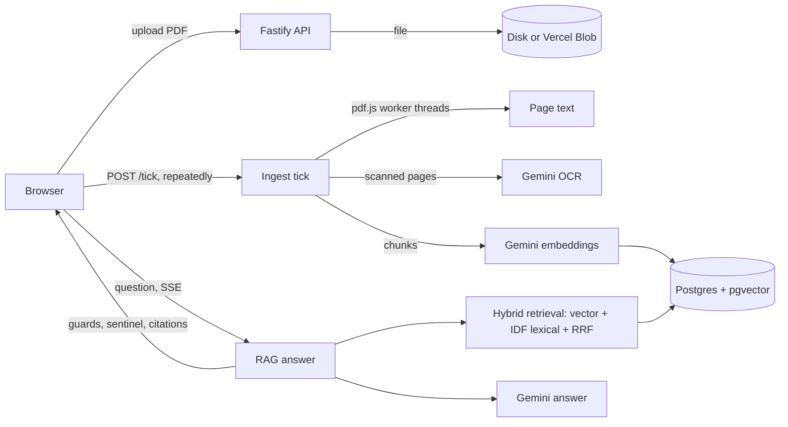

# Architecture

## Monorepo layout

npm workspaces, TypeScript everywhere, ESM.

```
packages/shared   zod schemas for the API contract, error codes, text normalisation, limits
apps/server       Fastify API (src/: app, http, ingest, pdf, ocr, gemini, embeddings, llm, rag, db, storage, session, limits)
apps/web          Vite + React + React Three Fiber (src/: scene, book, diarypage, state, ui, pdf, reveal, audio, i18n)
api               Vercel function entry: api/index.ts re-exports apps/server/src/vercel.ts
e2e               Playwright journeys (deterministic server), live and perf projects
scripts           fixtures generator, Vercel bundle check, offline calibration
```

## Data flow



## Server

**Framework.** Fastify, one process locally (`main.ts`) or one Vercel Function (`vercel.ts`). Sessions are signed
cookies (`SESSION_SECRET`); rate limits are counters in the database so every instance shares them.

**Ingestion in ticks.** A document is read in short steps, not one long job. `POST /api/documents` stores the file and
creates a job row; the browser calls `POST /api/documents/:id/tick` until the document is ready. A tick takes a lease, does
what fits in `INGEST_TICK_BUDGET_MS` (parse, OCR, analyse and chunk, embed; `ingest/tick/step-*.ts`), saves its cursor after
every unit, and answers `running`, `ready`, `failed` or `parked`. A tick that is cut off costs one unit: the lease expires and
the next tick takes over. A used-up daily Gemini quota parks the job until it resets. State lives in `ingest_jobs` and
`ingest_stage_data`, so the same code runs on a laptop and on serverless.

**PDF reading.** pdf.js runs in worker threads (`ingest/worker/`) with a page timeout and a memory watchdog (hostile
images are killed). Threads stop cooperatively between pages; `terminate()` is only a fallback. Extraction repairs Arabic
text (presentation forms, line order) and detects page quality.

**OCR.** Pages that need it are cut out of the PDF (pdf-lib), up to `OCR_PAGES_PER_REQUEST` at a time, and sent to Gemini
(`OCR_MODEL`), which returns JSON text. Encrypted PDFs are rendered to images instead. Tesseract is an optional provider.

**Gemini access** (`gemini/`): one client, one pacer per model quota (`GEMINI_MAX_RPM`), retries, and daily budgets
(`limits/`) for answers, embeddings, OCR and auxiliary calls. `gemini-embedding-2` embeds chunks (768 dimensions);
`gemini-3.5-flash-lite` answers; a second lite model handles follow-up rewriting and the grounding check.

**Retrieval** (`rag/retrieve.ts`): per-document, exact pgvector KNN plus an IDF-weighted lexical ranking over folded
`search_text` (Arabic/Persian letter variants normalised), plus page-reference ranking ("page 2"), fused with Reciprocal
Rank Fusion (`rag/rrf.ts`). Chunks carry page numbers and highlight regions for citations.

**Answering and the guards** (`rag/answer.ts`, following the Lab2 design):

1. language-aware score floor (calibrated thresholds, `rag/calibration.ts`);
2. a yes/no grounding check on an auxiliary model (fails open on error);
3. the model's own refusal via the `NOT_IN_DOCUMENT` sentinel (`rag/sentinel.ts`).

Any of them yields a refusal in the question's language with `refusedBy` set. Prompts are written per language (Arabic
instructions in Arabic). Injection defence: excerpts are delimited data, spoofed delimiters are neutralised, and uncited
sentences survive only if they are anchored statements about the document's silence (`rag/silence.ts`); the output guard and
`injection.ts` drop the rest.

**SSE.** Answers stream as events (`rag/answer` to `http/answer-stream.ts`, `sse.ts`) validated by the shared contract:
status, text deltas, sources, done, or a typed error. Ingestion progress is polled via the tick response.

## Web

**Scene.** React Three Fiber (`scene/`): room, table, candle, dust, post-processing, quality tiers, and the 3D book
(`scene/book/`: leaf geometry and materials, a phase runner, a presenter that is the only thing driving the book, a
camera rig with named framings such as awaiting, writing and reveal).

**State machine and effects.** `state/experience.ts` holds the phases (discovery, opening, awaiting, uploading, reading, unveiling, manuscript, revealing, memory,
closing). Side effects live in `state/effects/` (session, upload, ingest, ask, conversation, reveal, close, config,
sample), each reacting to state changes; stores (`documentStore`, `chatStore`, `anchorStore`, `readerStore`) are small zustand
stores.

**Book model.** The book is a list of leaves whose faces come from page sources (`book/pageSource.ts`): `ParchmentPageSource`
(flyleaf, blank paper), `DiaryPageSource` (`diarypage/`, the diary pages with baked ink) and `PdfPageSource` (`pdf/`, the PDF
rendered by pdf.js into textures with a bounded cache and a render gate that never starts renders mid-turn). RTL documents
reverse the page order and binding side.

**Diary writing surface.** A real transparent `textarea` (accessibility, IME) sits over the page plane via anchors and CSS
`matrix3d`; an ink mirror layer draws what you type. Enter commits, the ink sinks in, and the answer is written in the same hand.
Exchanges are painted onto page textures (`diarypage/paint.ts`) so ink is physically in the book; at most 8 diary leaves are kept.

**Truth scene.** `ui/truth/` and `reveal/`: the "Show me the truth" line, a fast riffle, a clamped zoom (`scene/revealZoom.ts`),
the cited PDF page with a glow on the cited passage, `REVEAL_DONE`, then a ribbon return. Reduced motion crossfades instead.

**Simple view.** `ui/fallback/`: a plain accessible mirror of the conversation (ask field, exchange cards, truth dialog), used
when WebGL fails, on context loss, or on request.

**i18n.** `i18n/strings/` in English and Arabic; page numbers and chrome numerals follow the interface language.

## Shared contract and data model

`packages/shared` defines every request, response and SSE event as a zod schema (`api.ts`) plus error codes (`errors.ts`),
used by both server and web. The server validates with the same schemas.

Postgres (migrations `001_init`, `002_serverless`, `003_upload_tickets`):
`sessions`, `documents` (progress, language, direction), `document_pages`, `document_chunks` (text, `search_text`, generated
`tsv`, page range, highlights), `chunk_embeddings` (`vector`, model, dimensions), `conversations`, `messages` (with
sources and `refusedBy`), `ingest_jobs`, `ingest_stage_data`, `rate_counters` (rate limits and daily Gemini/Blob budgets) and `upload_tickets`. Embeddings carry the model name so the provider can change without a migration. There is no ANN index: retrieval is
always inside one document.

## Dependency rationale

| Dependency                      | Why                                                                |
| ------------------------------- | ------------------------------------------------------------------ |
| fastify                         | HTTP server, schemas, one codebase for Node and Vercel             |
| zod                             | One API contract validated on both sides                           |
| pdfjs-dist, @napi-rs/canvas     | Text extraction and page rendering in worker threads               |
| pdf-lib                         | Cutting scanned pages out for OCR                                  |
| @google/genai                   | Gemini answers, embeddings and OCR                                 |
| pg, @electric-sql/pglite        | Postgres with pgvector; embedded PGlite for zero-setup dev         |
| @vercel/blob, @vercel/functions | Private PDF storage and pool draining on Vercel                    |
| franc-min                       | Document language detection                                        |
| three, @react-three/fiber, drei | The 3D scene                                                       |
| react, zustand                  | UI and the small stores                                            |
| vitest, playwright, axe-core    | Unit/integration, end-to-end and accessibility tests               |
